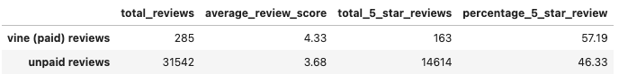
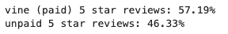

# Amazon-Vine-Analysis
Determining if there is any bias toward favorable reviews from Vine members in the data  using PySpark and AWS 

## Purpose:
To analyze Amazon reviews on tools, written by members of the paid Amazon Vine program.  Specifically, use PySpark to perform the ETL process on PySpark to extract a Amazon tools review dataset, transform the data, connect to an AWS RDS instance, and lastly load the transformed data into pgAdmin. Next, Pandas to determine if there is any bias toward favorable reviews from Vine members in this dataset.

## Results:
Below is a DataFrame to show the differences between vine (paid) reviews and unpaid reviews:

- The number of total reviews in this tool data set, the unpaid reviews consist of over 99.105% of the reviews.
- The number of total '5 star' reviews in this tool data set, the unpaid reviews consist of over 98.897% of the reviews.
- The percentages of 5 star reviews for vine (paid) and unpaid are 57.19% and 46.33% respectively.

## Summary:
At a glance it does seem to be some bias in the vine (paid) reviews. The percentage of 5 star reviews and the spread of review star values show a difference in each subset of data. 

Although seeing 1 and 2 star ratings statistically classified as outliers in the paid vine review data, we must use cation as it is a very small subset of data compared to the unpaid subset.  Further statistical analysis would be needed to determine if this diference is statistically significant to confirm bias in the paid vine review.  Additionally, the paid vine review are such a small subset of the review data that theu are insignificant to affect the 